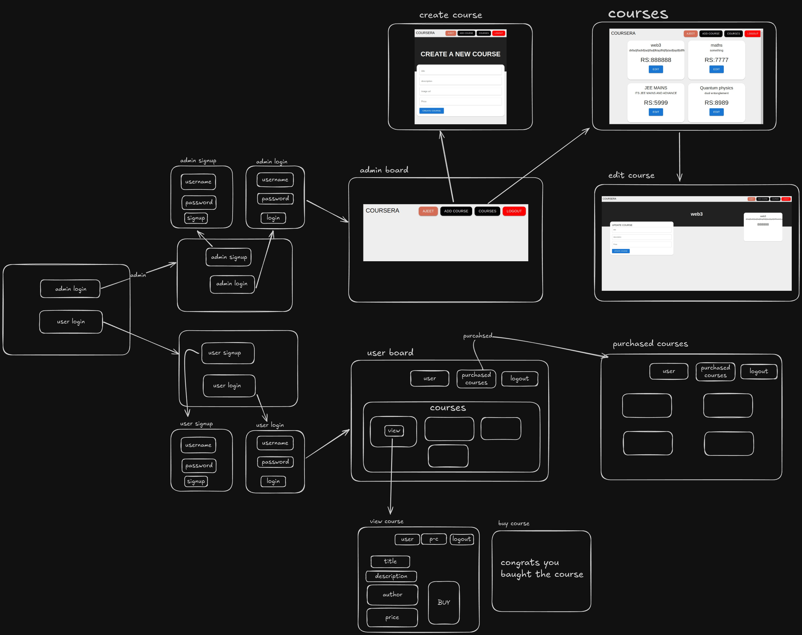

# COURSE-SELLING-WEBSITE

its a basic course selling website in this admin can signup/login and create the courses and user can also signup/login and purchase the respective courses

FUNCTIONALITIES:-
ADMIN:---
1. signup
2. login
3. logout
4. add-course
5. view all coures
6. edit course

USER:---
1. signup
2. login
3. logout
4. view all coures
5. buy any course
6. view the purchased course

WEBSITE-ARCHITECTURE:-

TO RUN LOCALLY:-
1. CLONE REPO
2. RUN npm install for frontend
3. RUN npm install for server
4. RUN FRONTEND npm run dev
5. RUN BACKEND node index.js
   
